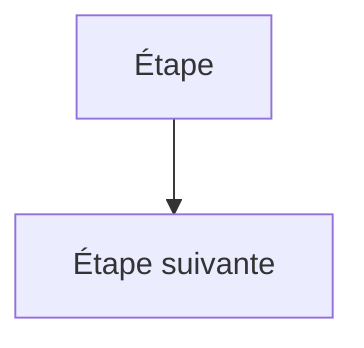

# CLAUDE.md

Instructions et conventions pour travailler sur ce dépôt. À lire avant toute contribution.

## Présentation

Application web **Vue 3 + Vite**, **local-first** (aucun backend applicatif) : audits **Lighthouse**, analyse par **LLM**, suivi quotidien **Watchlist** et **GEO Tracking** (visibilité de la marque dans les moteurs IA). Les données vivent dans le navigateur (IndexedDB / localStorage) et les clés d'API restent chez l'utilisateur.

## Conventions de documentation (IMPORTANT)

- **Langue : français, avec les accents.** Toute la documentation destinée à l'utilisateur (README, docs fonctionnelles, messages d'interface) est rédigée en français correctement accentué (é, è, à, ç, ô…). Ne jamais produire de français « désaccentué ».
- **Diagrammes : Mermaid uniquement, jamais d'ASCII.** Les schémas (architecture, flux, arborescences, hiérarchies) doivent utiliser des blocs ` ```mermaid `. Ne pas utiliser d'art ASCII ni de caractères de dessin de boîte / d'arborescence (box-drawing Unicode tels que les traits et coins de tableaux), y compris pour les arborescences de fichiers.

## Conventions d'interface (IMPORTANT)

- **Libellés avec deux-points, partout.** Tout libellé de champ, de groupe de contrôles ou de donnée (`label`/`<span>` au-dessus ou avant un input, un select, une liste de boutons, un badge…) se termine par un deux-points : `' :'` (espace + deux-points) en français, `':'` (sans espace) en anglais. Convention homogène sur toute l'application.
- **Tout champ doit avoir un libellé visible.** Un placeholder ne suffit pas : un champ pré-rempli masque son placeholder, et un select n'explique pas son rôle par son seul contenu. Toujours un `<label>` au-dessus.
- **Saisies mémorisées.** Toutes les saisies et sélections utilisateur sont persistées afin d'être restaurées d'une session à l'autre.
- **Mémorisation par marque/domaine.** Les saisies liées à un site (URL d'analyse, brouillons, mots-clés, contexte/sortie générés, sélection Search Console…) sont mémorisées **par couple marque/domaine actif** via `useScopedPersistentRef` : changer de marque ou de domaine restaure les saisies de ce contexte. Les préférences réellement globales (clés API et fournisseur LLM, thème, langue, intervalles, bascules d'affichage) restent en `usePersistentRef`.
- **Réponses IA en Markdown.** Toute sortie d'IA s'affiche via `MarkdownViewer` (et est consultable en pop-up `Modal`).

Exemple attendu :



## Commandes

| Commande | Rôle |
| --- | --- |
| `npm run dev` | Serveur de développement Vite |
| `npm run build` | Build de production (génère aussi `dist/404.html` pour le routage SPA) |
| `npm run test:run` | Suite de tests Vitest (une passe) |
| `npm run test:coverage` | Couverture de tests |
| `npm run server` | Serveur Lighthouse local (Chromium), optionnel |

## Architecture & conventions de code

- **Stores Pinia** en *setup syntax* (`defineStore('x', () => { … })`), persistance localStorage (réglages, watchlist, prompts GEO) ou IndexedDB (historique, rapports, runs GEO).
- **Composables** (`src/composables/`) pour la logique réutilisable ; **exporter les fonctions pures** (scoring, parsing, calculs) afin de les tester directement.
- **Formatters & helpers centralisés** dans `src/utils/` (`formatters.js`, `url.js`) — ne pas dupliquer la mise en forme ou la normalisation d'URL.
- **Composants** de taille raisonnable : extraire une carte/section dans son propre composant plutôt que gonfler une vue.
- **Couche LLM** : passer par `LLMProviderFactory` (`src/services/llm/`), ne pas réécrire d'appels `fetch` en dur dans les vues.
- **Local-first** : pas de backend ; les intégrations externes se font en BYO-key depuis le navigateur.

## Tests

- Framework : **Vitest** + `@vue/test-utils` + `happy-dom`.
- Couvrir en priorité la **logique métier pure** (ex. scoring GEO, détection de régression, normalisation d'URL) et les **stores**.
- Lancer `npm run test:run` avant de committer.
- Note : `tests/server/lighthouseConfig.spec.js` comporte un échec **pré-existant** (timeout `maxWaitForLoad`) sans rapport avec les évolutions récentes.

## Déploiement

Cible : **Cloudflare Pages** (SPA statique). Build command `npm run build`, répertoire de sortie `dist`. Le routage SPA repose sur `dist/404.html` (copie de `index.html` émise par un plugin Vite) — **ne pas** ajouter de règle `_redirects` `/* /index.html 200` (rejetée par Pages comme boucle infinie).

## Git

- Développer sur des branches de fonctionnalité, jamais directement sur `master` sans accord explicite.
- Messages de commit clairs et préfixés (`feat`, `fix`, `docs`, `refactor`, `chore`).
