# Lighthouse AI Analyzer

Application web **Vue 3 + Vite**, **« local-first »**, qui réunit en un seul outil l'audit de performance **Lighthouse**, l'analyse par **modèle de langage (LLM)**, le suivi quotidien (**Watchlist**, **Briefing**) et l'optimisation pour les moteurs de réponse IA (**GEO**, **llms.txt**).

Aucun backend applicatif : les données vivent dans votre navigateur (**IndexedDB** / **localStorage**) et les **clés d'API restent chez vous** (BYO-key, appels directs au fournisseur). L'application est installable en **PWA** et utilisable hors-ligne sur les données déjà stockées.

---

## 🧩 Concepts clés

Avant les scénarios, trois notions structurent toute l'application :

- **Le « site » est une entité indissociable** : un site = **marque + domaine + secteur d'activité** (par exemple « Concilio + www.concilio.com + conciergerie médicale »). On bascule d'un site à l'autre via un **sélecteur unique** dans l'en-tête. Le secteur lève l'ambiguïté du nom de marque dans les analyses IA.
- **Portée par site (scope)** : les saisies et collections liées à un site (URL d'analyse, brouillons, prompts GEO, watchlist, sélections Search Console…) sont **mémorisées par couple marque/domaine**. Changer de site restaure le contexte correspondant. Les préférences réellement globales (clés d'API, thème, langue, intervalles) restent communes.
- **BYO-key, local-first** : chaque intégration externe (PageSpeed, fournisseurs LLM, Search Console) utilise **vos** identifiants, depuis le navigateur. Rien ne transite par un serveur tiers.

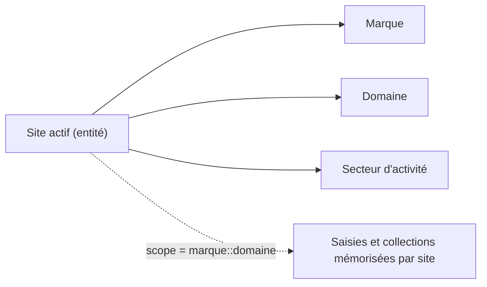

---

## 🗺️ Carte des écrans

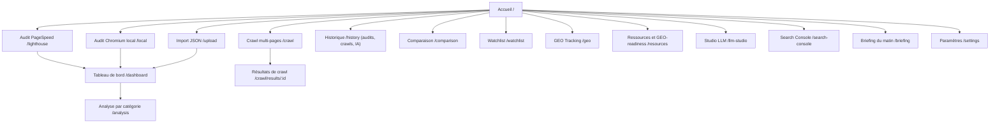

---

## 🎬 Scénarios d'usage

Chaque scénario ci-dessous est **réalisable tel quel** dans l'application. Les préconditions (clé d'API, serveur local) sont précisées et synthétisées dans la [matrice des préconditions](#-matrice-scénarios--préconditions).

### Scénario 0 — Premier lancement (onboarding)

Au tout premier démarrage, une fenêtre d'**onboarding** demande de créer le premier site : **marque**, **domaine** et, optionnellement, **secteur d'activité**. Ce trio devient le site actif (affiché dans l'en-tête) et préremplit les écrans. Tout est modifiable ensuite dans **Paramètres**.

### Scénario 1 — Auditer une page (trois sources au choix)

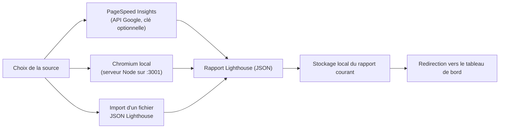

- **PageSpeed Insights** (`/lighthouse`) : saisir une URL, choisir la stratégie **mobile** ou **desktop**, lancer. Une **clé PageSpeed** est optionnelle (elle relève le quota). Annulation possible en cours d'analyse.
- **Chromium local** (`/local`) : nécessite le **serveur local** (voir [Installation](#-installation-et-démarrage)). Un voyant indique l'état de connexion ; lien de repli vers PageSpeed si le serveur est absent.
- **Import JSON** (`/upload`) : glisser-déposer (ou sélectionner) un fichier de rapport Lighthouse exporté ailleurs.

Dans les trois cas, le rapport courant est stocké localement puis le **tableau de bord** s'ouvre.

### Scénario 2 — Lire le tableau de bord et le plan d'action

Le tableau de bord (`/dashboard`) affiche :

- les **scores par catégorie** (Performance, Accessibilité, Bonnes pratiques, SEO), cliquables vers l'analyse détaillée ;
- les **Core Web Vitals** (LCP, CLS, TBT, FCP, Speed Index…) avec leur notation ;
- le **plan d'action priorisé** : les opportunités Lighthouse triées par **priorité = impact / effort**, avec étiquettes *faible / moyen / élevé*. Un bouton **« Générer les correctifs »** demande à l'IA un plan de remédiation (cause probable, étapes, extrait de code) affiché en Markdown.

> Précondition du plan d'action IA : un fournisseur LLM configuré. Les routes `/dashboard` et `/analysis` exigent un rapport chargé (sinon redirection vers l'accueil).

### Scénario 3 — Analyse détaillée d'une catégorie par l'IA

Sur `/analysis/:category`, on choisit une catégorie et un **gabarit de prompt**, on prévisualise le prompt envoyé, puis l'IA produit une **explication en Markdown** rendue **en flux (streaming)**. La sortie peut être **poursuivie** si elle est tronquée. Les audits en échec (score < 0,9) sont listés avec poids et explication. L'analyse est archivée dans l'**historique IA**.

### Scénario 4 — Crawl multi-pages d'un site

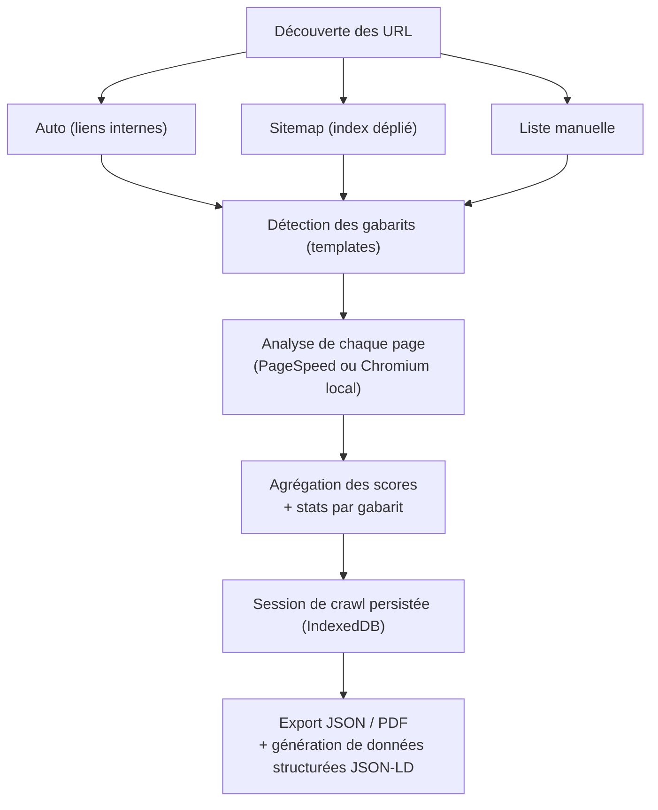

Sur `/crawl` : choisir le mode de découverte (**auto**, **sitemap**, **liste manuelle**), la source (PageSpeed ou Chromium local), la stratégie, le nombre de pages. Les résultats (`/crawl/results/:id`) présentent les **scores agrégés** et la **comparaison par gabarit**, l'**export JSON/PDF**, et un panneau de **génération de données structurées (JSON-LD)** par page. Les sessions sont historisées.

### Scénario 5 — Historique, filtres et comparaison

- **Historique** (`/history`) : trois onglets — **Audits**, **Crawls**, **IA**. Côté audits : domaines groupés, filtres (recherche, stratégie, chemin), **sparklines** de tendance, **export JSON** (par domaine ou global) et **export PDF** (captures de graphiques). On sélectionne deux audits d'une même page pour les comparer.
- **Comparaison** (`/comparison`) : trois modes — **fichiers** (deux JSON côte à côte), **sessions** (deux crawls, comparaison par gabarit), **historique** (deux audits suivis). Les écarts sont mis en évidence (vert/rouge).

### Scénario 6 — Watchlist (suivi quotidien des URL)

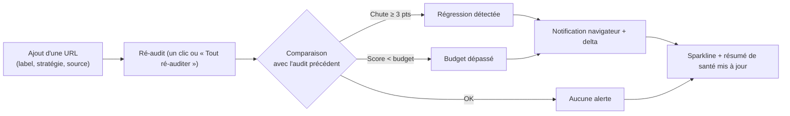

Sur `/watchlist` : ajouter des URL (label, stratégie, source PageSpeed ou local), définir des **budgets par catégorie** (0–100), détecter les **régressions** (Δ ≤ -3 points) et **dépassements de budget**, recevoir des **notifications navigateur**, suivre une **sparkline**, **ré-auditer** en un clic, **exporter en CSV**.

### Scénario 7 — GEO Tracking (visibilité de la marque dans les IA)

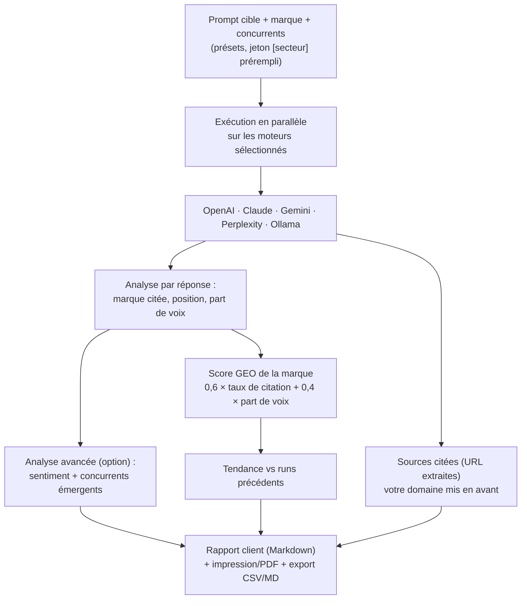

Sur `/geo` :

- **définir des prompts cibles** (avec marque issue du site actif et concurrents), à partir de **présets** dont le **jeton `[secteur]` est prérempli** par le secteur du site ;
- **interroger plusieurs moteurs en parallèle** : OpenAI, Claude, Gemini, **Perplexity** (qui renvoie de **vraies sources citées**) et Ollama. **Tous les moteurs restent visibles** ; ceux sans clé sont grisés (cadenas) et ouvrent l'éditeur de clés au clic — aucun moteur ne « disparaît » ;
- mesurer par moteur : **marque citée**, **position**, **part de voix**, et — avec l'**analyse avancée** — **sentiment** et **concurrents émergents** ;
- consulter les **sources citées** agrégées entre moteurs, **votre domaine mis en avant** (✓) ;
- lire le **score GEO** de la marque (0–100, pondération 60 % taux de citation + 40 % part de voix moyenne) et sa **tendance** ;
- recevoir des **alertes** (marque perdue, part de voix en baisse) ;
- **exporter** : rapport client en Markdown (avec méthodologie et recommandations), **impression/PDF**, tableau **CSV/Markdown**.

### Scénario 8 — Ressources et score de GEO-readiness

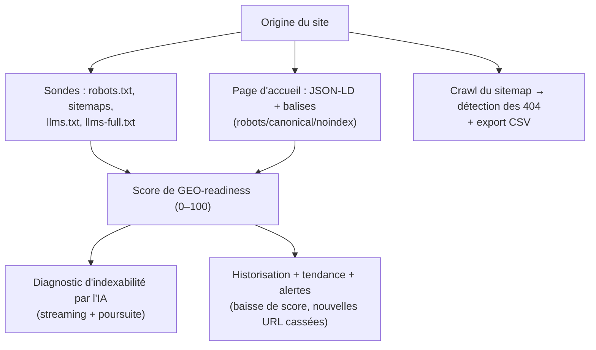

Sur `/resources` : vérifier la présence de **robots.txt**, des **sitemaps** (avec décompte d'URL et dépliage d'index), de **llms.txt** / **llms-full.txt** ; détecter et **valider les données structurées JSON-LD** et les directives d'indexation ; obtenir un **score de GEO-readiness** détaillé par signal ; lancer un **crawl du sitemap** pour repérer les **404** (export CSV) ; demander un **diagnostic d'indexabilité par l'IA** ; **historiser** le score avec **tendance** et **alertes**.

> Précondition : l'accès aux fichiers du site cible passe par le **serveur local** (proxy CORS) ou un proxy configuré. Le diagnostic IA requiert un fournisseur LLM.

### Scénario 9 — Studio LLM (générer llms.txt / llms-full.txt)

Sur `/llm-studio` : **analyser un domaine** (page d'accueil, structure du sitemap par sections, détection des fichiers déjà en ligne), puis **générer** :

- **llms.txt** : fichier d'index/résumé ;
- **llms-full.txt** : corpus complet (texte des pages clés du header/footer).

La génération est **streamée** et **poursuivable** si tronquée. Une **veille automatique** revérifie les domaines suivis selon un **intervalle** configurable. Les fichiers générés et les versions en ligne consultées sont archivés dans l'**historique IA** (export Markdown).

### Scénario 10 — Search Console (données de recherche réelles)

Sur `/search-console` : se connecter en **OAuth navigateur** avec **votre ID client** (BYO Client ID), choisir une **propriété**, une **période** (7/28/90 jours) et une **dimension** (requête ou page). On obtient le **résumé** (clics, impressions, CTR, position), une **tendance des clics** et l'**historisation** des relevés. Le jeton d'accès reste **en mémoire** (jamais persisté) ; seul l'ID client est conservé localement.

### Scénario 11 — Briefing du matin (tout en un coup d'œil)

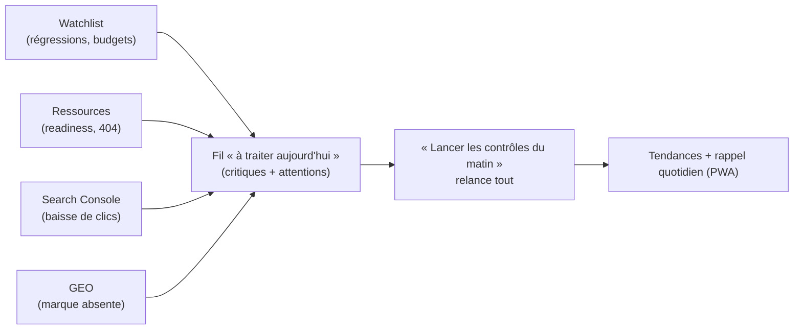

Sur `/briefing` : un tableau de bord unifié agrège **Watchlist**, **Ressources**, **Search Console** et **GEO** en un **fil « à traiter aujourd'hui »** (régressions, budgets dépassés, baisse de readiness, 404, chute de clics, marque absente des IA). Le bouton **« Lancer les contrôles du matin »** relance l'ensemble. Tendances en sparklines, **export Markdown**, et **rappel quotidien** via la PWA.

### Scénario 12 — Paramètres (identité, IA, réseau, données)

Sur `/settings` :

- **Sites suivis** : gérer les entités (marque + domaine + secteur), en activer une, éditer le secteur, ajouter/supprimer ;
- **Fournisseurs LLM** : choisir le fournisseur et le modèle (liste dynamique via `listModels` quand disponible, ex. Gemini), saisir une **clé par fournisseur** (OpenAI, Anthropic, Gemini, Perplexity) ou configurer **Ollama** (local) ; **max tokens** ;
- **PageSpeed** : clé d'API optionnelle (quota) ;
- **Search Console** : ID client OAuth ;
- **Réseau avancé** : *user-agent*, base de proxy, mode de récupération (**direct** ou **proxy**) ;
- **Données** : réinitialisation de toutes les bases (IndexedDB + localStorage) ;
- **Thème** et **langue** (français / anglais).

### Scénario 13 — Installer en PWA et travailler hors-ligne

L'application est **installable** (bureau/mobile). Le service worker sert l'app en *network-first* et garde un repli hors-ligne ; les **données déjà stockées** (historique, watchlist, runs GEO…) restent consultables sans connexion. Raccourcis vers **Watchlist** et **Historique** depuis l'icône installée.

---

## ✅ Matrice scénarios → préconditions

| Scénario | Clé LLM | Clé PageSpeed | Serveur local / proxy | OAuth GSC | Accès réseau au site |
| --- | :---: | :---: | :---: | :---: | :---: |
| Audit PageSpeed | — | optionnelle | — | — | ✔ |
| Audit Chromium local | — | — | **requis** | — | ✔ |
| Import JSON | — | — | — | — | — |
| Recommandations / correctifs IA | **requise** | — | — | — | — |
| Crawl (PageSpeed) | pour JSON-LD | recommandée | — | — | ✔ |
| Crawl (local) | pour JSON-LD | — | **requis** | — | ✔ |
| Watchlist | — | selon source | selon source | — | ✔ |
| GEO Tracking | **par moteur** | — | Ollama : local | — | ✔ |
| Ressources / GEO-readiness | diagnostic IA | — | **requis (CORS)** | — | ✔ |
| Studio LLM (llms.txt) | **requise** | — | **requis (CORS)** | — | ✔ |
| Search Console | — | — | — | **requis** | — |
| Briefing | selon modules | selon modules | selon modules | selon modules | ✔ |

---

## 🏗️ Architecture

Séparation claire en couches : vues, état (Pinia), logique réutilisable (composables) et services d'accès aux API externes.

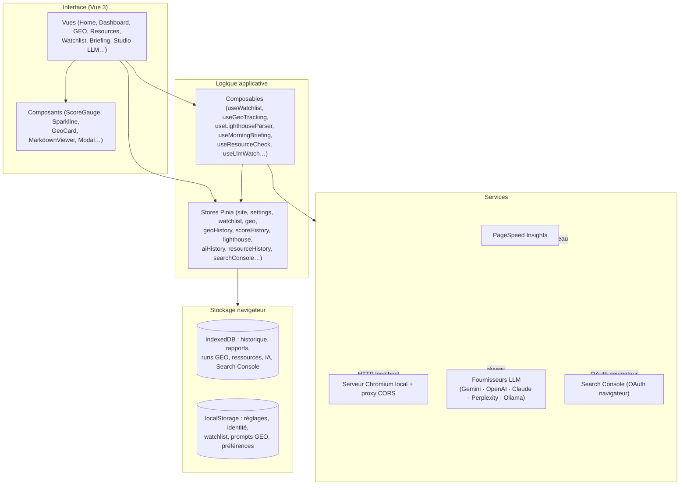

### Flux d'un audit

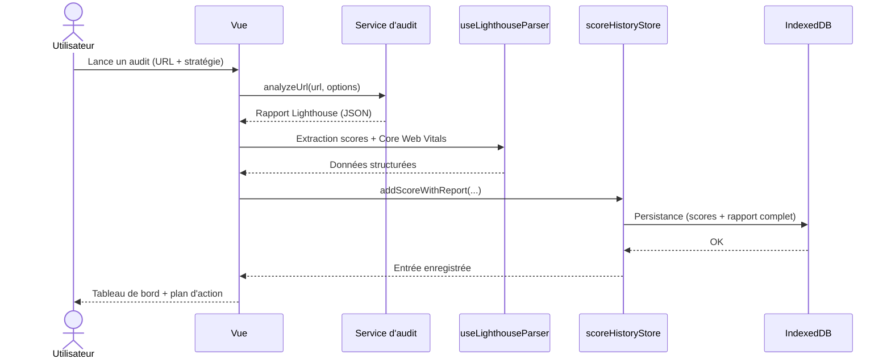

### Cycle du GEO Tracking

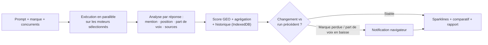

---

## 🗃️ Stockage des données

| Donnée | Emplacement | Portée |
| --- | --- | --- |
| Rapport courant | localStorage (`current-report`) | unique |
| Historique des scores + rapports complets | IndexedDB (`lighthouse-history`) | multi-domaine |
| Sessions de crawl | IndexedDB (`lighthouse-history`) | multi-domaine |
| Runs GEO | IndexedDB (`geo-tracking`) | par prompt |
| Snapshots Ressources | IndexedDB (`resource-history`) | par origine |
| Artefacts IA (analyses, llms.txt…) | IndexedDB | par site |
| Snapshots Search Console | IndexedDB (`search-console-history`) | par propriété |
| Identité (sites/entités) | localStorage | global |
| Réglages (clés LLM, PageSpeed, GSC) | localStorage (`lighthouse-settings`) | global |
| Watchlist | localStorage | par site |
| Prompts GEO | localStorage (`geo-prompts`) | par site |
| Préférences UI (thème, langue, onglets…) | localStorage | global / par fonction |

---

## 🧰 Stack technique

[](https://skillicons.dev)

- **Front-end** : Vue 3 (Composition API), Vite, Vue Router, Pinia
- **UI** : Tailwind CSS (v4), Chart.js (`vue-chartjs`), `@vueuse/core`
- **Rendu & export** : `marked`, `DOMPurify` (assainissement du Markdown IA), `highlight.js`, `jspdf`, `html2canvas`
- **Couche LLM** : fabrique de fournisseurs (Gemini, OpenAI, Claude, Perplexity, Ollama)
- **Serveur d'audit local** : Node, Express, Lighthouse, `chrome-launcher` (+ proxy CORS)
- **Tests** : Vitest, `@vue/test-utils`, `happy-dom`

---

## 🚀 Installation et démarrage

### Prérequis

- Node.js `^20.19.0` ou `>=22.12.0`
- (Optionnel) Chromium installé en local pour le serveur d'audit local

### Front-end

```sh
npm install
npm run dev        # serveur de développement avec rechargement à chaud
```

### Serveur Lighthouse local (optionnel)

Nécessaire pour la source « Chromium local », le **crawl local** et le **proxy CORS** (Ressources / Studio LLM sur des domaines tiers).

```sh
npm run server:install   # installe les dépendances du serveur
npm run server           # démarre le serveur sur http://localhost:3001
```

### Build de production

```sh
npm run build
npm run preview          # prévisualise le build
```

---

## ☁️ Déploiement (Cloudflare Pages)

L'application est une SPA statique : elle se déploie directement sur Cloudflare Pages.

**Réglages de build à configurer :**

| Paramètre | Valeur |
| --- | --- |
| Build command | `npm run build` |
| Build output directory | `dist` |
| Node version | `20` ou plus (variable `NODE_VERSION`) |

> ⚠️ Le **répertoire de sortie doit être `dist`**. S'il pointe vers la racine du dépôt, Cloudflare sert le `index.html` source (qui référence `/src/main.js`, inexistant en production) et la page reste **blanche**.

**Routage SPA — par `404.html`, sans `_redirects` :**
Un plugin Vite (`spaFallback` dans `vite.config.js`) émet, au build, un **`dist/404.html` identique à `index.html`**. Cloudflare Pages sert ainsi le *shell* de l'application pour les liens profonds (`/watchlist`, `/history`…) et les rechargements.

> ❌ **Ne pas** ajouter de règle `_redirects` du type `/* /index.html 200` : Cloudflare Pages la **rejette** (détectée comme boucle). Le mécanisme `404.html` la remplace entièrement.

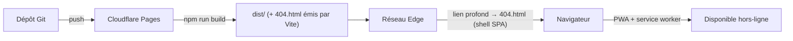

> Le serveur Chromium local (`server/`) n'est **pas** déployé sur Cloudflare : c'est un utilitaire optionnel exécuté sur le poste de l'utilisateur. En production, privilégiez la source PageSpeed Insights ou l'import de fichiers.

---

## 📜 Scripts disponibles

| Script | Description |
| --- | --- |
| `npm run dev` | Serveur de développement Vite |
| `npm run build` | Build de production (émet aussi `dist/404.html`) |
| `npm run preview` | Prévisualise le build |
| `npm run test` | Vitest en mode interactif |
| `npm run test:run` | Suite de tests (une passe) |
| `npm run test:coverage` | Rapport de couverture |
| `npm run test:ui` | Interface Vitest |
| `npm run server` | Serveur Lighthouse local (port 3001) |
| `npm run server:dev` | Serveur local en mode watch |
| `npm run server:install` | Installe les dépendances du serveur |
| `npm run server:stop` | Arrête le serveur local (port 3001) |

---

## 📱 PWA (Progressive Web App)

- **Manifeste** : `public/manifest.webmanifest` (mode `standalone`, raccourcis Watchlist / Historique)
- **Service worker** : `public/sw.js` (*network-first* pour la navigation et les ressources de même origine ; les appels externes ne sont jamais interceptés)
- **Enregistrement** : `src/main.js`, **en production uniquement** (en développement, les service workers existants sont désinscrits)
- **Rappel quotidien** : déclenché par l'événement `periodicsync` du service worker (notification « Briefing du matin »)

> Les données d'audit restent dans IndexedDB / localStorage et demeurent disponibles hors-ligne.

---

## 🌐 Internationalisation

i18n maison sans dépendance : fragments `src/i18n/messages/{fr,en}/*.js` auto-collectés et fusionnés, locale **réactive** et **persistée**, repli sur le français si une clé manque. Langues : **français** (par défaut) et **anglais**.

---

## 🗂️ Structure du projet

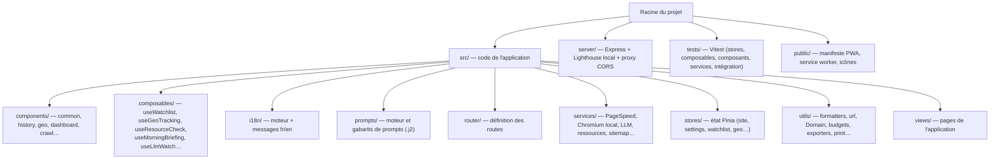

---

## 🔎 Search Console (configuration)

La connexion se fait **dans le navigateur** (aucun secret côté serveur) :

1. Dans **Google Cloud Console**, activer l'**API Search Console**.
2. Créer un **ID client OAuth 2.0** de type « Application Web » et ajouter l'origine du site (ex. `https://mon-site.pages.dev`) aux **origines JavaScript autorisées**.
3. Coller cet ID client dans l'écran **Search Console**, puis se connecter.

Le jeton d'accès reste **en mémoire** (jamais persisté). Seul l'ID client est conservé localement.

---

## 🧪 Tests

```sh
npm run test:run
```

La suite couvre stores, composables, composants, services et quelques tests d'intégration (montage de vues, préremplissage du site, éditeur d'identité).

---

## 🔒 Confidentialité

- Les **clés d'API** (LLM, PageSpeed) sont stockées localement et envoyées **directement** au fournisseur choisi — elles ne transitent par aucun serveur tiers.
- L'**historique**, la **watchlist** et les **artefacts IA** résident dans IndexedDB / localStorage de votre navigateur.
- Le jeton **Search Console** reste en mémoire (non persisté).
- La source « Chromium local » permet d'analyser des sites internes / privés sans les exposer à un service externe.

---

## 🧭 Configuration IDE recommandée

[VS Code](https://code.visualstudio.com/) + l'extension [Vue (Official)](https://marketplace.visualstudio.com/items?itemName=Vue.volar) (désactiver Vetur).
