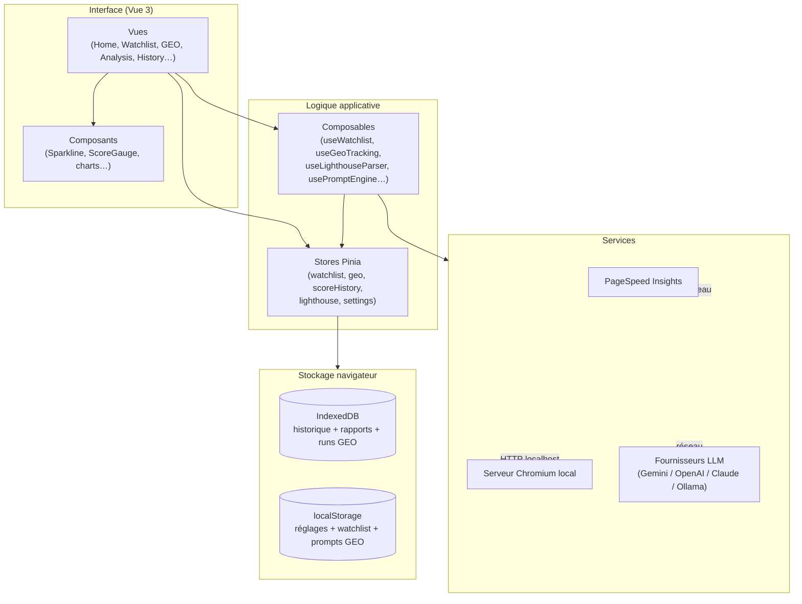
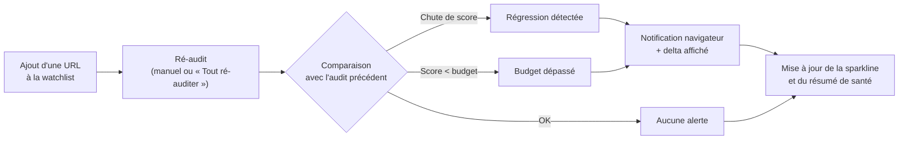
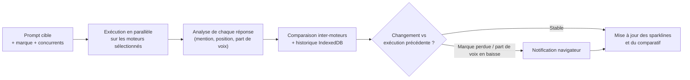
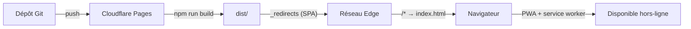
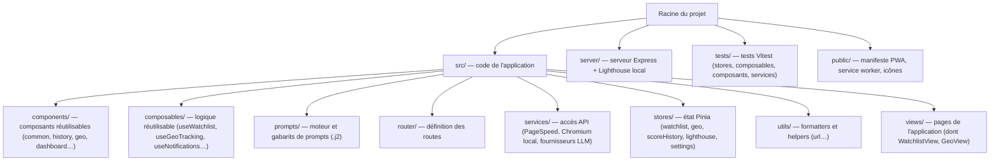

# Lighthouse AI Analyzer

Application web **Vue 3** d'analyse et de **suivi quotidien** de la santé de vos pages : elle exécute des audits **Lighthouse**, en extrait les scores et les Core Web Vitals, puis génère des recommandations d'optimisation grâce à un **modèle de langage (LLM)**.

L'application est **« local-first »** : aucune donnée n'est envoyée à un serveur applicatif. Les clés d'API restent chez vous, l'historique est stocké dans votre navigateur (IndexedDB / localStorage), et l'application est installable comme une **PWA** pour un usage hors-ligne au quotidien.

---

## ✨ Fonctionnalités

- **Trois sources d'audit** : API Google PageSpeed Insights, Chromium local (via un serveur Node), ou import d'un fichier JSON Lighthouse.
- **Analyse par IA** : recommandations générées via Gemini, OpenAI, Claude (Anthropic) ou Ollama, à partir de gabarits de prompts versionnés.
- **Mode Crawl** : analyse de plusieurs pages d'un site avec agrégation des scores par gabarit (template).
- **Historique & comparaison** : évolution des scores dans le temps, comparaison de sessions et de pages.
- **Watchlist** : tableau de bord de suivi quotidien des URLs surveillées, avec :
  - scores récents par catégorie et **détection de régression** (delta vs audit précédent) ;
  - **budgets de performance** par catégorie, avec alerte visuelle en cas de dépassement ;
  - **notifications navigateur** lors d'une régression ou d'un budget non atteint ;
  - **courbe de tendance** (sparkline) et ré-audit en un clic.
- **GEO Tracking** (*Generative Engine Optimization*) : suivi de la visibilité de votre marque dans les réponses des moteurs IA, avec :
  - **prompts cibles** + marque + concurrents, interrogés sur **plusieurs moteurs en parallèle** (OpenAI, Claude, Gemini, Ollama) ;
  - mesure par moteur : **marque citée**, **position** et **part de voix** face aux concurrents ;
  - **comparaison inter-moteurs**, courbe de tendance et **alertes** quand la visibilité change.
- **Export** : Markdown, PDF, et sauvegarde / restauration de l'historique au format JSON.
- **PWA** : installable sur le bureau ou le mobile, fonctionne hors-ligne sur les données déjà stockées.

---

## 🏗️ Architecture

L'application suit une séparation claire en couches : vues, gestion d'état (Pinia), logique réutilisable (composables) et services d'accès aux API externes.



### Flux d'un audit


### Cycle de la Watchlist



### Cycle du GEO Tracking



---

## 🧰 Stack technique

[](https://skillicons.dev)

- **Front-end** : Vue 3 (Composition API), Vite, Vue Router, Pinia
- **UI** : Tailwind CSS, Chart.js (`vue-chartjs`)
- **Rendu & export** : `marked`, `highlight.js`, `jspdf`, `html2canvas`
- **Serveur d'audit local** : Node, Express, Lighthouse, `chrome-launcher`
- **Tests** : Vitest, `@vue/test-utils`, `happy-dom`

---

## 🚀 Installation et démarrage

### Prérequis

- Node.js `^20.19.0` ou `>=22.12.0`
- (Optionnel) Chromium installé en local pour le serveur d'audit local

### Front-end

```sh
npm install
npm run dev        # serveur de développement avec rechargement à chaud
```

### Serveur Lighthouse local (optionnel)

Nécessaire uniquement pour la source « Chromium local ». Il pilote Chromium pour exécuter les audits sans dépendre de l'API PageSpeed.

```sh
npm run server:install   # installe les dépendances du serveur
npm run server           # démarre le serveur sur http://localhost:3001
```

### Build de production

```sh
npm run build
npm run preview          # prévisualise le build
```

---

## ☁️ Déploiement (Cloudflare Pages)

L'application est une SPA statique : elle se déploie directement sur Cloudflare Pages.

**Réglages de build à configurer dans le tableau de bord Cloudflare :**

| Paramètre | Valeur |
| --- | --- |
| Build command | `npm run build` |
| Build output directory | `dist` |
| Node version | `20` ou plus (variable `NODE_VERSION`) |

> ⚠️ Le **répertoire de sortie doit être `dist`**. S'il pointe vers la racine du dépôt, Cloudflare sert le `index.html` source (qui référence `/src/main.js`, inexistant en production) et la page reste **blanche**.

**Fichiers fournis (copiés automatiquement à la racine de `dist/`) :**

- `public/_redirects` → `/*  /index.html  200` : repli SPA indispensable pour que les routes côté client (`/watchlist`, `/history`…) et les rechargements ne renvoient pas un 404.
- `public/_headers` : empêche la mise en cache longue du service worker (`/sw.js`) et fixe le type MIME du manifeste.



> Le serveur Chromium local (`server/`) n'est **pas** déployé sur Cloudflare : c'est un utilitaire optionnel exécuté sur le poste de l'utilisateur. En production, privilégiez la source PageSpeed Insights ou l'import de fichiers.

---

## 📜 Scripts disponibles

| Script | Description |
| --- | --- |
| `npm run dev` | Démarre le serveur de développement Vite |
| `npm run build` | Génère le build de production |
| `npm run preview` | Prévisualise le build de production |
| `npm run test` | Lance Vitest en mode interactif |
| `npm run test:run` | Exécute la suite de tests une fois |
| `npm run test:coverage` | Génère un rapport de couverture |
| `npm run server` | Démarre le serveur Lighthouse local |
| `npm run server:dev` | Serveur local en mode watch |
| `npm run server:stop` | Arrête le serveur local (port 3001) |

---

## 📱 PWA (Progressive Web App)

L'application est installable et fonctionne hors-ligne :

- **Manifeste** : `public/manifest.webmanifest`
- **Service worker** : `public/sw.js` (network-first pour la navigation, stale-while-revalidate pour les ressources statiques)
- **Enregistrement** : effectué dans `src/main.js`, **en production uniquement** (pour éviter toute mise en cache gênante en développement)

> ℹ️ Le service worker ne met jamais en cache les appels réseau externes (API PageSpeed, fournisseurs LLM, serveur local). Les données d'audit restent dans IndexedDB / localStorage et demeurent disponibles hors-ligne.

---

## 🗂️ Structure du projet



---

## 🧪 Tests

La suite de tests couvre les stores, composables, composants et services.

```sh
npm run test:run
```

---

## 🔒 Confidentialité

- Les **clés d'API** (LLM) sont stockées localement dans votre navigateur et envoyées directement au fournisseur choisi — elles ne transitent par aucun serveur tiers.
- L'**historique des audits** et la **watchlist** résident dans IndexedDB / localStorage de votre navigateur.
- La source « Chromium local » permet d'analyser des sites internes / privés sans les exposer à un service externe.

---

## 🧭 Configuration IDE recommandée

[VS Code](https://code.visualstudio.com/) + l'extension [Vue (Official)](https://marketplace.visualstudio.com/items?itemName=Vue.volar) (désactiver Vetur).
