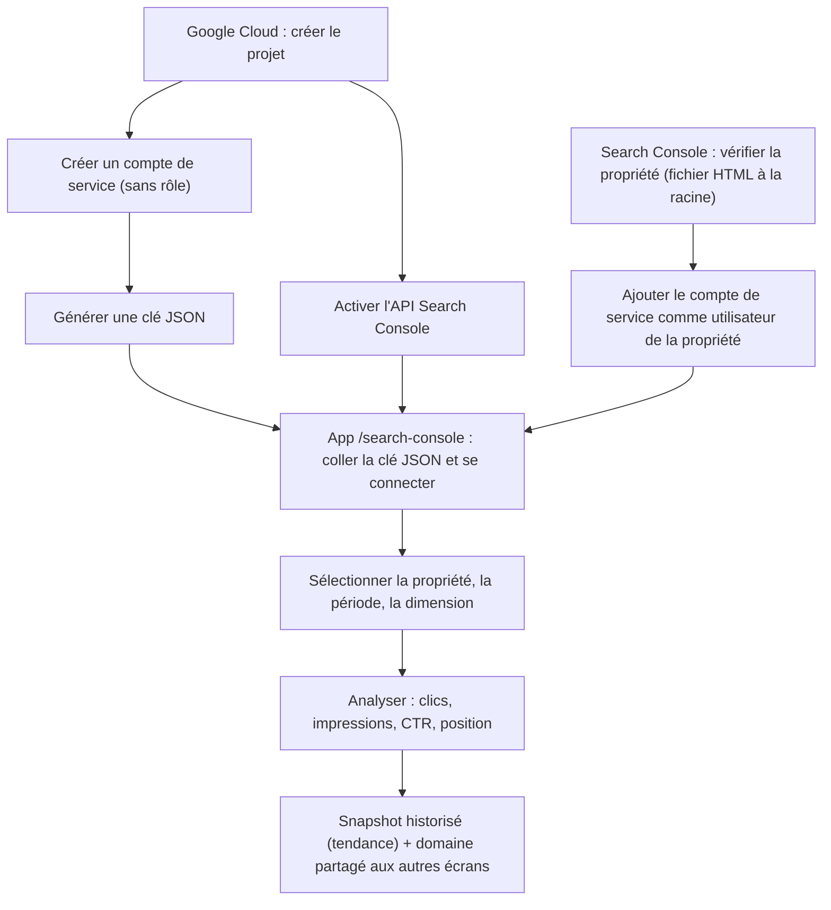
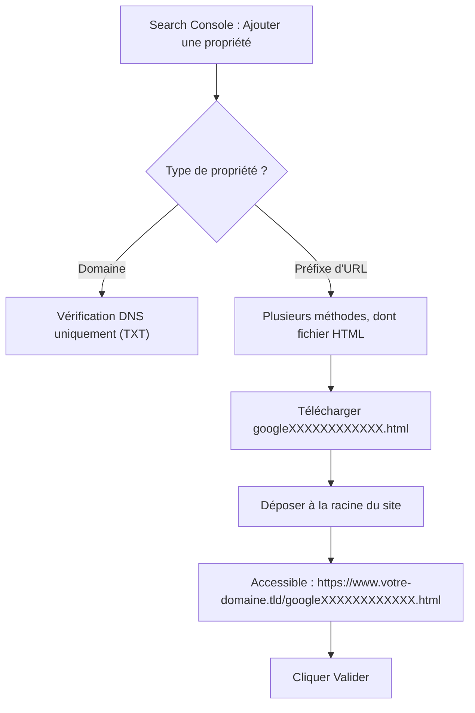
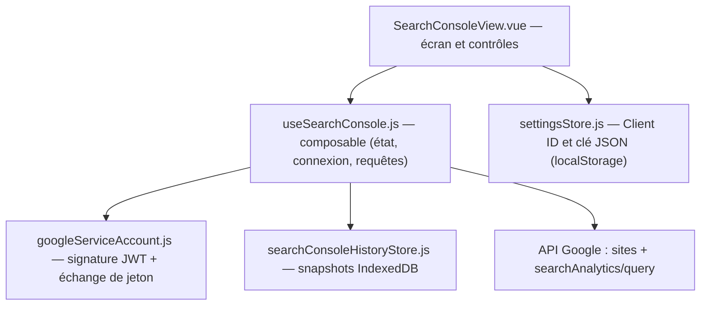
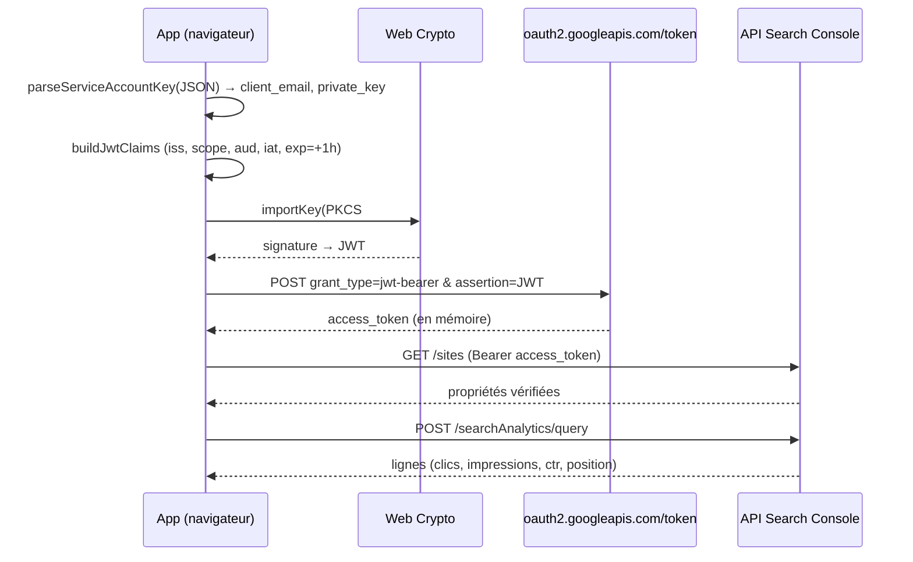

# Search Console : mise en place et fonctionnement

Ce document décrit, de bout en bout, comment raccorder une propriété **Google Search Console** à l'application et comment fonctionne l'écran `/search-console`. Toutes les valeurs sont **anonymisées** : remplacez les espaces réservés (`votre-domaine.tld`, `mon-projet-seo`, etc.) par les vôtres.

Espaces réservés utilisés ci-dessous :

| Espace réservé | Signification |
| --- | --- |
| `votre-domaine.tld` | Domaine racine du site à analyser |
| `www.votre-domaine.tld` | Hôte réellement servi (avec ou sans `www`) |
| `mon-projet-seo` | Identifiant du projet Google Cloud |
| `lighthouse-sc@mon-projet-seo.iam.gserviceaccount.com` | E-mail du compte de service |
| `googleXXXXXXXXXXXX.html` | Fichier de vérification fourni par Search Console |
| `https://app.example.tld/search-console` | URL de l'écran Search Console de l'app |

> **Local-first.** L'application n'a pas de backend. Les clés restent dans votre navigateur (localStorage), les jetons d'accès vivent uniquement en mémoire, et l'historique est stocké en IndexedDB. Rien n'est envoyé à un serveur applicatif.

---

## 1. Vue d'ensemble du parcours

Trois briques indépendantes doivent être prêtes avant la connexion : la **clé JSON** (compte de service), l'**API activée**, et la **propriété vérifiée + partagée** avec le compte de service.

---

## 2. Mise en place (une seule fois)

### 2.1 Créer le compte de service et sa clé JSON

1. Console Google Cloud → sélectionner (ou créer) le projet `mon-projet-seo`.
2. **API et services** → **Identifiants** → **Créer des identifiants** → **Compte de service**.
3. Donner un nom (ex. `lighthouse-sc`). À l'étape **« Autorisations (facultatif) »**, **ne sélectionner aucun rôle** : l'accès aux données Search Console ne passe **pas** par les rôles IAM du projet, mais par le partage de propriété (étape 2.4). Cliquer **Continuer** puis **OK**.
4. Ouvrir le compte de service créé → onglet **Clés** → **Ajouter une clé** → **Créer une clé** → **JSON**. Un fichier se télécharge : il contient `client_email` et `private_key`. **Conservez-le en lieu sûr** (il vaut un mot de passe).

### 2.2 Activer l'API Search Console

Toujours dans `mon-projet-seo` : **API et services** → **Bibliothèque** → rechercher **Google Search Console API** → **Activer**. C'est la **seule** API nécessaire (ni Tag Manager API, ni autre).

### 2.3 Vérifier la propriété : fichier HTML à la racine (méthode retenue)

Cette méthode est la plus **portable** : elle ne dépend ni d'un accès DNS, ni d'un accès « Publier » à un conteneur Tag Manager. Il suffit de pouvoir **déposer un fichier à la racine du site**.

Étapes :

1. [search.google.com/search-console](https://search.google.com/search-console) → **Ajouter une propriété**.
2. Choisir **Préfixe d'URL** (le fichier HTML n'est pas proposé pour le type **Domaine**, qui n'accepte que le DNS). Saisir l'URL **exacte** servie : `https://www.votre-domaine.tld/`.
3. Méthode de validation → **Fichier HTML** → télécharger `googleXXXXXXXXXXXX.html`.
4. Déposer ce fichier **à la racine** du site, de sorte qu'il réponde à `https://www.votre-domaine.tld/googleXXXXXXXXXXXX.html` (HTTP 200, contenu intact, pas de redirection).
5. Revenir dans Search Console et cliquer **Valider**.

> **Choix `www` ou non.** Une propriété **Préfixe d'URL** ne couvre **qu'une** variante exacte. Déclarez celle que sert réellement le site (par ex. `https://www.votre-domaine.tld/`). Pour couvrir toutes les variantes et sous-domaines d'un coup, il faut une propriété **Domaine** — mais elle exige une vérification **DNS**.

> **Conserver le fichier.** Ne supprimez pas `googleXXXXXXXXXXXX.html` après coup : Google revérifie périodiquement. S'il disparaît, la propriété peut être dévérifiée.

### 2.4 Partager la propriété avec le compte de service

La vérification prouve **votre** propriété. Le **compte de service** est une identité distincte : il faut l'autoriser explicitement, sinon la liste des propriétés revient **vide** dans l'app.

1. Search Console → propriété `www.votre-domaine.tld` → **Paramètres** → **Utilisateurs et autorisations**.
2. **Ajouter un utilisateur** → coller `lighthouse-sc@mon-projet-seo.iam.gserviceaccount.com`.
3. Autorisation **Complet** (ou **Restreint**, suffisant pour la lecture des données).

> C'est l'oubli le plus fréquent : sans cette étape, l'authentification réussit mais aucune propriété n'apparaît.

---

## 3. Utilisation dans l'application

Écran : `https://app.example.tld/search-console`.

### 3.1 Connexion

Deux méthodes sont proposées via un sélecteur en haut de l'écran :

- **OAuth (popup)** : on saisit un **Client ID OAuth 2.0** (type « Application Web »), une popup Google s'ouvre pour autoriser l'accès. Pratique pour un usage interactif ponctuel.
- **Compte de service (clé JSON)** : on colle le **contenu du fichier JSON**, la connexion est **automatique, sans popup**. Méthode retenue ici (reproductible, scriptable, idéale pour un suivi régulier).

Parcours « compte de service » :

1. Onglet **Compte de service (clé JSON)**.
2. Coller **tout** le contenu du fichier JSON dans la zone de texte.
3. **Se connecter**. La liste des propriétés vérifiées se remplit.

### 3.2 Analyse

1. **Site** : sélectionner la propriété. Selon le type vérifié, l'identifiant est `https://www.votre-domaine.tld/` (préfixe d'URL) ou `sc-domain:votre-domaine.tld` (domaine).
2. **Période** : 7, 28 ou 90 jours.
3. **Dimension** : **Requêtes** ou **Pages**.
4. **Analyser**.

Résultats affichés :

- Quatre indicateurs agrégés : **Clics**, **Impressions**, **CTR moyen**, **Position moyenne**.
- Un **tableau** des 50 premières lignes (requête/page, clics, impressions, CTR, position).
- Une **tendance des clics** (sparkline) construite à partir des analyses précédemment enregistrées pour cette propriété.

### 3.3 Effets de bord utiles

- Chaque analyse non vide enregistre un **snapshot** (résumé) en IndexedDB → c'est ce qui alimente la courbe de tendance d'une fois sur l'autre.
- Le **domaine interrogé est mémorisé** et partagé avec les autres écrans (audit Lighthouse, watchlist…) : vous pouvez enchaîner directement sur un audit du même site.
- La propriété sélectionnée est **mémorisée par couple marque/domaine actif** : changer de marque restaure la sélection propre à ce contexte.

---

## 4. Fonctionnement technique (« la totale »)

### 4.1 Pièces en jeu

| Fichier | Rôle |
| --- | --- |
| `src/views/SearchConsoleView.vue` | Interface : sélecteur de méthode, formulaires, tableau, tendance |
| `src/composables/useSearchConsole.js` | État réactif, connexion OAuth ou compte de service, appels API, helpers purs |
| `src/services/googleServiceAccount.js` | Parse la clé JSON, signe le JWT (RS256), l'échange contre un jeton |
| `src/stores/searchConsoleHistoryStore.js` | Persistance des snapshots en IndexedDB |
| `src/stores/settingsStore.js` | Mémorise le Client ID et la clé JSON (préférences globales) |

### 4.2 Authentification par compte de service

Aucune popup : on fabrique un **JWT signé** localement, qu'on échange contre un jeton d'accès.

Points clés :

- **Scope** : `https://www.googleapis.com/auth/webmasters.readonly` (lecture seule).
- **Signature** : `RSASSA-PKCS1-v1_5` + SHA-256, via `crypto.subtle` (Web Crypto). La **clé privée ne quitte jamais le navigateur**.
- **Jeton** : valable 1 h, conservé **en mémoire uniquement** (perdu au rechargement, on se reconnecte).
- **CORS** : l'échange de jeton vise `https://oauth2.googleapis.com/token`, qui autorise les requêtes navigateur — pas besoin de proxy.

### 4.3 Requête analytique et calculs

- **Endpoints** :
  - Liste des propriétés : `GET https://www.googleapis.com/webmasters/v3/sites`
  - Données : `POST https://searchconsole.googleapis.com/webmasters/v3/sites/{siteUrl}/searchAnalytics/query`
- **Filtrage des propriétés** : on écarte celles où le niveau de permission est `siteUnverifiedUser`.
- **Fenêtre de dates** : Search Console accuse un décalage d'environ **2 jours**. La période demandée se termine donc **2 jours avant** la date du jour, et s'étend sur `days` jours (`dateRangeISO`).
- **Agrégation** (`summarizeRows`) : les clics et impressions sont **sommés** ; le **CTR** et la **position** sont **pondérés par les impressions** (moyenne pondérée), ce qui évite de fausser les moyennes.

### 4.4 Persistance

| Donnée | Support | Portée |
| --- | --- | --- |
| Client ID OAuth, clé JSON | localStorage (`settingsStore`) | Globale |
| Méthode d'auth, période, dimension | localStorage (`usePersistentRef`) | Globale |
| Propriété sélectionnée | localStorage (`useScopedPersistentRef`) | Par marque/domaine actif |
| Snapshots d'analyse | IndexedDB (`search-console-history`) | Par propriété (`site`) |

Chaque snapshot stocke `{ site, days, dimension, clicks, impressions, ctr, position, timestamp }`. La courbe de tendance lit les snapshots de la propriété (les plus récents d'abord) et construit une série chronologique des clics.

---

## 5. Dépannage

| Symptôme | Cause probable | Action |
| --- | --- | --- |
| Liste de propriétés **vide** après connexion | Compte de service non ajouté comme utilisateur de la propriété | Refaire l'étape 2.4 |
| Propriété attendue absente | Mauvais type (`sc-domain:` vs `https://…/`) ou mauvaise variante `www` | Vérifier le type/préfixe déclaré |
| `403` / `401` à l'analyse | API non activée, ou permissions insuffisantes du compte de service | Vérifier l'étape 2.2 et le rôle dans Search Console |
| Échec d'obtention du jeton | Clé JSON tronquée ou `private_key` malformée | Recoller l'intégralité du fichier JSON |
| Données vides sur une période courte | Décalage de 2 jours / faible trafic | Élargir à 28 ou 90 jours |
| Propriété « dévérifiée » plus tard | Fichier `googleXXXXXXXXXXXX.html` supprimé de la racine | Le rétablir à la racine |

---

## 6. Sécurité

- La clé JSON contient une **clé privée** : ne l'utilisez que sur un **poste de confiance**. Elle reste dans le localStorage du navigateur.
- Préférez l'autorisation **Restreint** (lecture) lors du partage de propriété si vous n'avez besoin que des données.
- En cas de doute ou de poste partagé, utilisez le bouton **Déconnexion** (vide le jeton et la liste en mémoire) et, si besoin, **révoquez la clé** côté Google Cloud puis générez-en une nouvelle.
</content>
</invoke>
